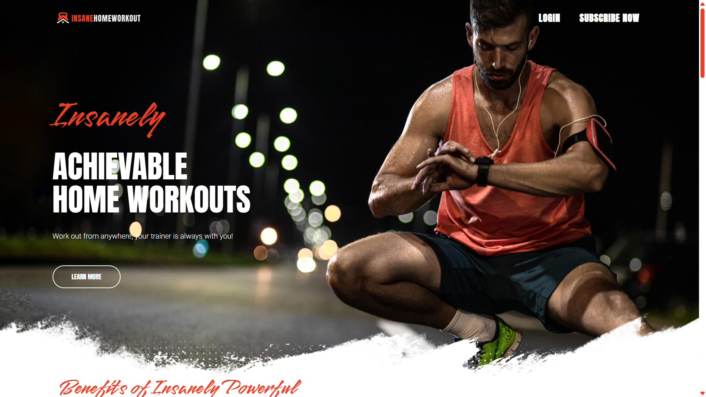

# 🏋️ Fitness Landing Page

A modern, responsive **Fitness Landing Page** built with **HTML, Tailwind CSS, and JavaScript**, designed to showcase a clean UI, strong visuals, and professional front-end practices.

---

## 🚀 Live Demo
🔗 https://joe-elkilani.github.io/FITNESS/

> (Joe-Elkilani / FITNESS)

---

## 📸 Preview



---

## ✨ Features
- Fully responsive design (Mobile, Tablet, Desktop)
- Modern UI inspired by real fitness platforms
- Clean and structured HTML5
- Tailwind CSS for fast and scalable styling
- Custom CSS for background images and sections
- Smooth scrolling experience
- Optimized images and assets
- Font Awesome icons integration

---

## 🛠️ Technologies Used
- **HTML5**
- **Tailwind CSS**
- **Vanilla JavaScript**
- **Google Fonts**
- **Git & GitHub**

---

👨‍💻 Author

Yousef Elkilani
Front-End Developer

GitHub: [https://github.com/USERNAME](https://github.com/Joe-Elkilani)

LinkedIn: www.linkedin.com/in/yousef-elkilani-234467369

---

## 📂 Project Structure
```text
├── assets
│   ├── css
│   │   ├── input.css
│   │   └── output.css
│   └── js
│       └── main.js
├── public
│   └── imgs
├── index.html
└── README.md
